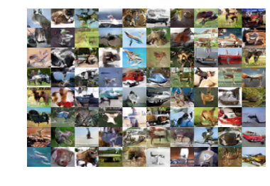

## CIFAR10 on Cloud TPU

Author: Tom Brown, Joel Shor, David Westbrook

### How to run

You can run the introductory tutorial Colab notebook
[here](https://github.com/tensorflow/gan/examples/colab_notebooks/tfgan_tutorial.ipynb).
You can run the cloud TPU Colab notebook
[here](https://github.com/tensorflow/gan/examples/colab_notebooks/tfgan_on_tpus.ipynb).

### Description

#### TF-GAN Tutorial

This Colab notebook introduces TF-GAN's `GANEstimator`.
The estimator framework abstracts the training details so
you can focus on the details that matter.

#### TF-GAN on TPUs Tutorial

This Colab notebook shows you how to use
TF-GAN's `TPUGANEstimator` to train GANs on Google's cloud TPU. This
infrastructure gives you unprecedented compute power and batch size. In
less than **five minutes**, you can train an unconditional GAN on CIFAR10.

