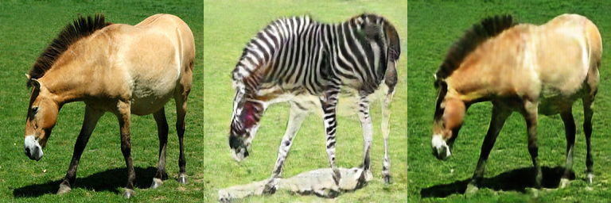

## CycleGAN

Author: Shuo Chen

### How to run


1.  Run the setup instructions in `tensorflow_gan/examples/README.md`
1.  Install `pillow` with ex `pip install Pillow`.
1.  Download the
    [`tensorflow_models` github repo](https://github.com/tensorflow/models) for
    access to network architectures ex `git clone
    https://github.com/tensorflow/models.git $TF_MODELS_DIR`.
1.  Add the 'research' sub-directory to the PYTHONPATH with ex: `export
    PYTHONPATH=${TF_MODELS_DIR}/research:${PYTHONPATH}`
1.  Run:

```
python cyclegan/train.py
```

### Description

Based on the paper ["Unpaired Image-to-Image Translation using Cycle-Consistent
Adversarial Networks"](https://arxiv.org/abs/1703.10593), this example converts
one set of images into another set in an unpaired way.

#### CycleGAN


