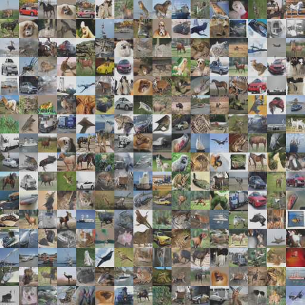

## Progressive GAN

Author: Shuo Chen

### How to run


1. Run the setup instructions in `tensorflow_gan/examples/README.md`
1. Install matplotlib ex `pip install matplotlib`
1. Run:

```python
python progressive_gan/train_main.py --alsologtostderr
```

### Description

An implementation of
[Progressive Growing of GANs for Improved Quality, Stability, and Variation](https://arxiv.org/abs/1710.10196).
We run the network on the CIFAR10 dataset.


